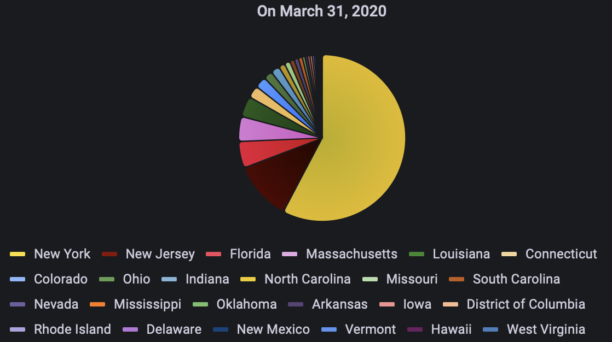

[Top](../README.md) | [Next](./II-traditional-approaches.md)

# I. The imaginative case
## I.1. Summary

The [*imaginative case*](#the-imaginative-case) describes  
- How 3143 counties reported daily COVID data containing the numbers of cases and deaths. These reports are collected into a central repository.
- How the Federal CDC monitors the cases according to their specific requirements.
- How the State of California State receives a stream of daily reports with California-only data, and how do they perform their own monitoring.
- How the John Hopkins University determine correlation in case surges in counties connected by commercial passenger air routes.
 

## I.2. Daily Report from counties

The [COVID-19 Dataset](https://www.kaggle.com/datasets/sudalairajkumar/covid19-in-usa) from **Kaggle** is used for US daily cases.

A daily report from a county is a data point with some pieces of information as follow:
+ The date of observation as a string in a format of `YYYY-MM-DD`, e.g. `2020-02-24`;
+ The name of the county of observation, for example `Snohomish` (in `Washington State`);
+ The state of the county, for example `Washington` (as in `Washington State`);
+ The (US) FIPS code of the county as a 5-digit string, e.g. `53061` (`Snohomish County`, `Washington State`), this uniquely identifies the county;
+ The number of positive cases;
+ The number of fatalities.

Each county collects the number of cases, from wherever they are identified by some means, and submits the data at the beginning of the next day. For the imaginative case this data point is the only assumption of daily report.

The first `10` daily reports
| date       | county      | state      | fips  | cases | deaths |
|------------|-------------|------------|-------|-------|--------|
| 2020-01-22 | Snohomish   | Washington | 53061 | 1     | 0      |
| 2020-01-23 | Snohomish   | Washington | 53061 | 1     | 0      |
| 2020-01-24 | Cook        | Illinois   | 17031 | 1     | 0      |
| 2020-01-24 | Snohomish   | Washington | 53061 | 1     | 0      |
| 2020-01-25 | Orange      | California | 6059  | 1     | 0      |
| 2020-01-25 | Cook        | Illinois   | 17031 | 1     | 0      |
| 2020-01-25 | Snohomish   | Washington | 53061 | 1     | 0      |
| 2020-01-26 | Maricopa    | Arizona    | 4013  | 1     | 0      |
| 2020-01-26 | Los Angeles | California | 6037  | 1     | 0      |

Reports from 10 counties of `Virginia` on `April 11, 2020`
| date       | county              | state    | fips  | cases | deaths |
|------------|---------------------|----------|-------|-------|--------|
| 2020-11-04 | Tazewell            | Virginia | 51185 | 572   | 2      |
| 2020-11-04 | Virginia Beach city | Virginia | 51810 | 8419  | 108    |
| 2020-11-04 | Warren              | Virginia | 51187 | 639   | 22     |
| 2020-11-04 | Washington          | Virginia | 51191 | 1144  | 28     |
| 2020-11-04 | Waynesboro city     | Virginia | 51820 | 411   | 4      |
| 2020-11-04 | Westmoreland        | Virginia | 51193 | 355   | 5      |
| 2020-11-04 | Williamsburg city   | Virginia | 51830 | 231   | 8      |
| 2020-11-04 | Winchester city     | Virginia | 51840 | 666   | 4      |
| 2020-11-04 | Wise                | Virginia | 51195 | 734   | 10     |

*Note that in reality the cases might be collected from various sources (hospitals, clinics, emergency centres, etc manually or automatically. They might be collected via phone calls, emails, extracted from reports, or from computer systems. The data might have been going through aggregation, filtering, duplication checks, source verification, etc. There are no limitations nor the additional fields in any data point, their structures, an unified process or set of methods on how the data points might be computed, collected, or controlled. This reflects the true nature of the ways how IT usage and applications have been developed and used over time. In the second part a few common patterns of usage are discussed.*

All daily reports are submitted into a central repository. This is the place where other actors of the case - the Federal CDC, the State of California, and the John Hopkins University - access the data and use for their purposes.

*Note that in practice, the data collection might have to go through multiple levels, for example from all counties in a state into the repository of health data in that state, and then from all the states to the federal repository. It could also happen in a way that hospitals and clinics report the cases via their organization, then based on state- or federal-level or agreement, the data stream reaches each state individually or through another level of aggregation/filtering. In emergency cases, depending on pre-defined or adhoc protocol, different structure of reporting streams can be put in place, which greatly increase the complexity to accommodate the automation for the use cases of monitoring and analysis at any level. The imaginative case assumes that the daily reports are in uniform format, delivered from different sources but through a common method, and collected into a single repository.*

In this case, the assumption is that the daily reports from the counties are in a single format of comma-separated value (CSV) text files.

*Note that the data points submitted from the counties might have different names for fields. Some might have been called `covid_cases` instead of `cases`. The data types of the fields used by different counties for the same meaning might vary between integer, floating-points, string. Some fields like `cases` and `deaths` might also be grouped in a substructure. It is also possible that the data encapsulation formats used by different counties might be entirely different. They might use Excel, comma-separated text files (CSV), JSON, XML, just text, or any other imaginable and unimaginable standards.*

## I.3. Monitoring at the Federal CDC

The Federal CDC accesses the central repository. The repository is to demonstrate a common aggregation pattern in data stream. The Federal CDC at the moment performs the following cases:

1. The first `10` reports

| date       | county      | state      | fips  | cases | deaths |
|------------|-------------|------------|-------|-------|--------|
| 2020-01-22 | Snohomish   | Washington | 53061 | 1     | 0      |
| 2020-01-23 | Snohomish   | Washington | 53061 | 1     | 0      |
| 2020-01-24 | Cook        | Illinois   | 17031 | 1     | 0      |
| 2020-01-24 | Snohomish   | Washington | 53061 | 1     | 0      |
| 2020-01-25 | Orange      | California | 6059  | 1     | 0      |
| 2020-01-25 | Cook        | Illinois   | 17031 | 1     | 0      |
| 2020-01-25 | Snohomish   | Washington | 53061 | 1     | 0      |
| 2020-01-26 | Maricopa    | Arizona    | 4013  | 1     | 0      |
| 2020-01-26 | Los Angeles | California | 6037  | 1     | 0      |

2. The number of cases in each of the states on `March 31, 2020` (only the `top 10` - by `percentage` - are shown below) as table

| state         | cases | percent |
|---------------|-------|---------|
| New York      | 76211 | 41      |
| New Jersey    | 15013 | 8       |
| Michigan      | 7536  | 4       |
| California    | 8583  | 4       |
| Massachusetts | 6285  | 3       |
| Florida       | 6742  | 3       |
| Illinois      | 5986  | 3       |
| Washington    | 5062  | 2       |
| Louisiana     | 5215  | 2       |
| Georgia       | 3934  | 2       |
| Pennsylvania  | 4997  | 2       |
| Texas         | 3588  | 1       |

3. The number of cases in each of the states on `March 31, 2020`  as pie chart

4. The timeline of cases from `January 22, 2020` to `April 30, 2020` in `Washington State` (partially shown)

## I.4. Monitoring at the State of California

The State of California receives a data stream from the central repository. The stream contains daily reports from counties residing inside California. This is to demonstrate a transforming/filtering data based on field/value. The data points received by the State of California contains only the following

A daily report from a county is a data point with some pieces of information:
+ The date of observation as a string in a format of `YYYY-MM-DD`, e.g. `2020-02-24`;
+ The name of the county of observation, for example `Snohomish` (in `Washington State`);
+ The (US) FIPS code of the county as a 5-digit string, e.g. `53061` (`Snohomish County`, `Washington State`), this uniquely identifies the county;
+ The number of positive cases;
+ The number of fatalities.

*Note that the data point in this case does not contain the field for the state name*

1. Counties with positive cases on `April 1, 2020` as table sorted from largest to smallest and a pie chart visualization

2. Counties with fatalities on `April 1, 2020` as table sorted from largest to smallest and a pie chart visualization

## I.5. Data Science at John Hopkins University

The John Hopkins University is tasked with finding correlated surges in counties. One of the hypotheses is that an (unaware) infected person in a county when travel to another county by air will choose an air routes connecting two airports which are within a preferable distance from both both counties. In more details:
- COVID spread via contacts among passengers travelled via air routes.
- Each of these air routes connects not only the two cities at its immediate ends, but also any (cities in) counties within 40 miles or approx. 60 kilometres. This distance is a convenient for anyone resides in counties to chose an airport for travel.
- Connected county pairs would have well-correlated surge of cases and deaths.

The first dataset is the [US counties dataset](https://simplemaps.com/data/us-counties). Each county in this dataset contains:
- County short name, such as `Los Angeles`;
- County name in ASCII, such as `Los Angeles`;
- County full name in ASCII, such as `Los Angeles County`;
- County (US) FIPS code, such as `6073` (to be precise `06073`) for `Los Angeles County`;
- State ID, the two-letter code for US state where the county resides, such as `CA` for `California`;
- State name, the name of the state where the county resides, such as `California`;
- Latitude, the latitude of the county geo-reference;
- Longitude, the latitude of the county geo-reference;
- Population, the population of the county

| county      | county_ascii | county_full        | county_fips | state_id | state_name | lat     | lng       | population |
|-------------|--------------|--------------------|-------------|----------|------------|---------|-----------|------------|
| Los Angeles | Los Angeles  | Los Angeles County | 6037        | CA       | California | 34.3209 | -118.2247 | 10040682   |
| Cook        | Cook         | Cook County        | 17031       | IL       | Illinois   | 41.8401 | -87.8168  | 5169517    |
| Harris      | Harris       | Harris County      | 48201       | TX       | Texas      | 29.8578 | -95.3936  | 4680609    |
| Maricopa    | Maricopa     | Maricopa County    | 4013        | AZ       | Arizona    | 33.3490 | -112.4915 | 4412779    |
| San Diego   | San Diego    | San Diego County   | 6073        | CA       | California | 33.0343 | -116.7350 | 3323970    |
| Orange      | Orange       | Orange County      | 6059        | CA       | California | 33.7031 | -117.7609 | 3170345    |
| Miami-Dade  | Miami-Dade   | Miami-Dade County  | 12086       | FL       | Florida    | 25.6149 | -80.5623  | 2705528    |
| Dallas      | Dallas       | Dallas County      | 48113       | TX       | Texas      | 32.7666 | -96.7778  | 2622634    |
| Kings       | Kings        | Kings County       | 36047       | NY       | New York   | 40.6395 | -73.9385  | 2576771    |

The second dataset at is the [World airports dataset](https://ourairports.com/data/). Each airport in this dataset contains:
- Continent: which continent the airport resides;
- Latitude: the latitude of the airport geo-reference;
- Longitude: the longitude of the airport geo-reference;
- Elevation: the elevation of the airport geo-reference;
- GPS code: the GPS code of the airport;
- IATA code: the `IATA code` of the airport;
- Identification: the unique identification of the airport (in this dataset);
- Country: the two-letter country code;
- Region: the two-letter country code, follow by a hyphen, then a first level administrative code, in US case it's the two-letter state code;
- Local code: locally defined code (valid for inside the country);
- Municipality: name of the municipality where the airport resides;
- Name: full name of the airport;
- Type: type of the airport - heliport, seaplane, close, small airport, ...

| continent | lng                 | lat                | elevation_ft | gps_code | iata_code | ident | iso_country | iso_region | local_code | municipality  | name                           | type          |
|-----------|---------------------|--------------------|--------------|----------|-----------|-------|-------------|------------|------------|---------------|--------------------------------|---------------|
| NA        | -90.8468017578125   | 34.100101470947300 | 153          | 02MS     |           | 02MS  | US          | US-MS      | 02MS       | Rochdale      | Watts Field                    | small_airport |
| NA        | -111.74304          | 47.2374            | 3350         |          |           | 02MT  | US          | US-MT      |            | Cascade       | Barrett Field                  | closed        |
| NA        | -93.797418          | 36.654233          | 1550         |          |           | 02MU  | US          | US-MO      |            | Cassville     | Timber Line Airpark            | closed        |
| NA        | -80.597778          | 35.541111          | 809          | 02NC     |           | 02NC  | US          | US-NC      | 02NC       | Landis        | Race City Heliport             | heliport      |
| NA        | -96.90450286865230  | 41.074501037597700 | 1550         | 02NE     |           | 02NE  | US          | US-NE      | 02NE       | Valparaiso    | Benes Service Airport          | small_airport |
| NA        | -71.21910095214840  | 44.657100677490200 | 1180         | 02NH     |           | 02NH  | US          | US-NH      | 02NH       | Dummer        | Iroquois Landing Seaplane Base | seaplane_base |
| NA        | -74.46710205078130  | 40.55730056762700  | 78           | 02NJ     |           | 02NJ  | US          | US-NJ      | 02NJ       | Piscataway    | Penske Heliport                | heliport      |
| NA        | -118.5979995727540  | 41.30329895019530  | 4443         | 02NV     |           | 02NV  | US          | US-NV      | 02NV       | Winnemucca    | Paiute Meadows Airport         | small_airport |
| NA        | -75.65550231933590  | 43.132598876953100 | 435          | 02NY     |           | 02NY  | US          | US-NY      | 02NY       | Durhamville   | Hansen Heliport                | heliport      |
| NA        | -83.08329772949220  | 41.376399993896500 | 614          | 02OH     |           | 02OH  | US          | US-OH      | 02OH       | Fremont       | Zimmerman Airport              | small_airport |
| NA        | -80.56539916992190  | 41.801998138427700 | 950          | 02OI     |           | 02OI  | US          | US-OH      | 02OI       | Conneaut      | Murtha Airport                 | small_airport |
| NA        | -97.525297          | 35.458401          | 1191         |          |           | 02OK  | US          | US-OK      | 02OK       | Oklahoma City | Canon Heliport                 | closed        |
| NA        | -121.31600189209000 | 45.68149948120120  | 705          | 02OR     |           | 02OR  | US          | US-OR      | 02OR       | The Dalles    | Rowena Dell Airport            | small_airport |
| NA        | -77.556602          | 40.403596          | 591          |          |           | 02P   | US          | US-PA      | 02P        | Honey Grove   | Stottle Memorial Heliport      | heliport      |
| NA        | -79.7699966430664   | 40.43830108642580  | 1070         | 02PA     |           | 02PA  | US          | US-PA      | 02PA       | Monroeville   | Lag Iii Heliport               | heliport      |

The third dataset is the [Airport-to-Airport passenger traffic dataset](https://catalog.data.gov/dataset/consumer-airfare-report-table-1a-all-u-s-airport-pair-markets). Each route is undirected and connects two airports
- Year: the year of the data point;
- Quarter: the quarter of the data point;
- City 1: name of the city where one of the airports resides;
- City 2: name of the city where the other of the airports resides;
- Airport ID 1: internal ID of the first airport;
- Airport ID 2: internal ID of the second airport;
- Airport 1: the `IATA code` of the first airport;
- Airport 2: the `IATA code` of the second airport;
- Distance (in nautical miles);
- Average daily number of passengers in the quarter;
- Average daily fare for a flight in the quarter;

| year | quarter | city1                          | city2                                  | airportid_1 | airportid_2 | airport_1 | airport_2 | nsmiles | passengers  | fare        |
|------|---------|--------------------------------|----------------------------------------|-------------|-------------|-----------|-----------|---------|-------------|-------------|
| 2021 | 3       | Allentown/Bethlehem/Easton, PA | Tampa, FL (Metropolitan Area)          | 10135       | 14112       |  ABE      |  PIE      | 970     | 180.2173913 | 81.42943305 |
| 2021 | 3       | Allentown/Bethlehem/Easton, PA | Tampa, FL (Metropolitan Area)          | 10135       | 15304       |  ABE      |  TPA      | 970     | 19.13043478 | 208.9272727 |
| 2021 | 3       | Albuquerque, NM                | Dallas/Fort Worth, TX                  | 10140       | 11259       |  ABQ      |  DAL      | 580     | 204.4565217 | 184.5607124 |
| 2021 | 3       | Albuquerque, NM                | Dallas/Fort Worth, TX                  | 10140       | 11298       |  ABQ      |  DFW      | 580     | 264.0217391 | 182.6354055 |
| 2021 | 3       | Albuquerque, NM                | Phoenix, AZ                            | 10140       | 14107       |  ABQ      |  PHX      | 328     | 397.9347826 | 177.1146681 |
| 2021 | 3       | Nantucket, MA                  | New York City,  NY (Metropolitan Area) | 10154       | 11618       |  ACK      |  EWR      | 218     | 175.9782609 | 165.2661519 |
| 2021 | 3       | Nantucket, MA                  | New York City,  NY (Metropolitan Area) | 10154       | 12953       |  ACK      |  LGA      | 218     | 134.7826087 | 157.0864516 |
| 2021 | 3       | Colorado Springs, CO           | Dallas/Fort Worth, TX                  | 11109       | 11259       |  COS      |  DAL      | 602     | 193.9130435 | 122.7605381 |
| 2021 | 3       | Colorado Springs, CO           | Dallas/Fort Worth, TX                  | 11109       | 11298       |  COS      |  DFW      | 602     | 342.826087  | 154.4676284 |
| 2021 | 3       | Dallas/Fort Worth, TX          |  Pittsburgh, PA                        | 11259       | 14122       |  DAL      |  PIT      | 1067    | 64.67391304 | 209.0484034 |

First, only quarterly passenger traffic data for each route is available by the third dataset, and even that includes only the first quarter of 2020, which is inadequate. Second, a freely available dataset with exact daily numbers of passengers on each route for the duration of the daily reports cannot be obtained. Thus the analysis concentrates on the correlation of the surges based on **existence of the routes** rather than of the **time** travel, the **fare** of the flight, and the  **passengers traffic** or the route.

[Top](../README.md) | [Next](./II-traditional-approaches.md)