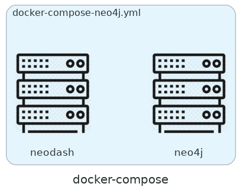
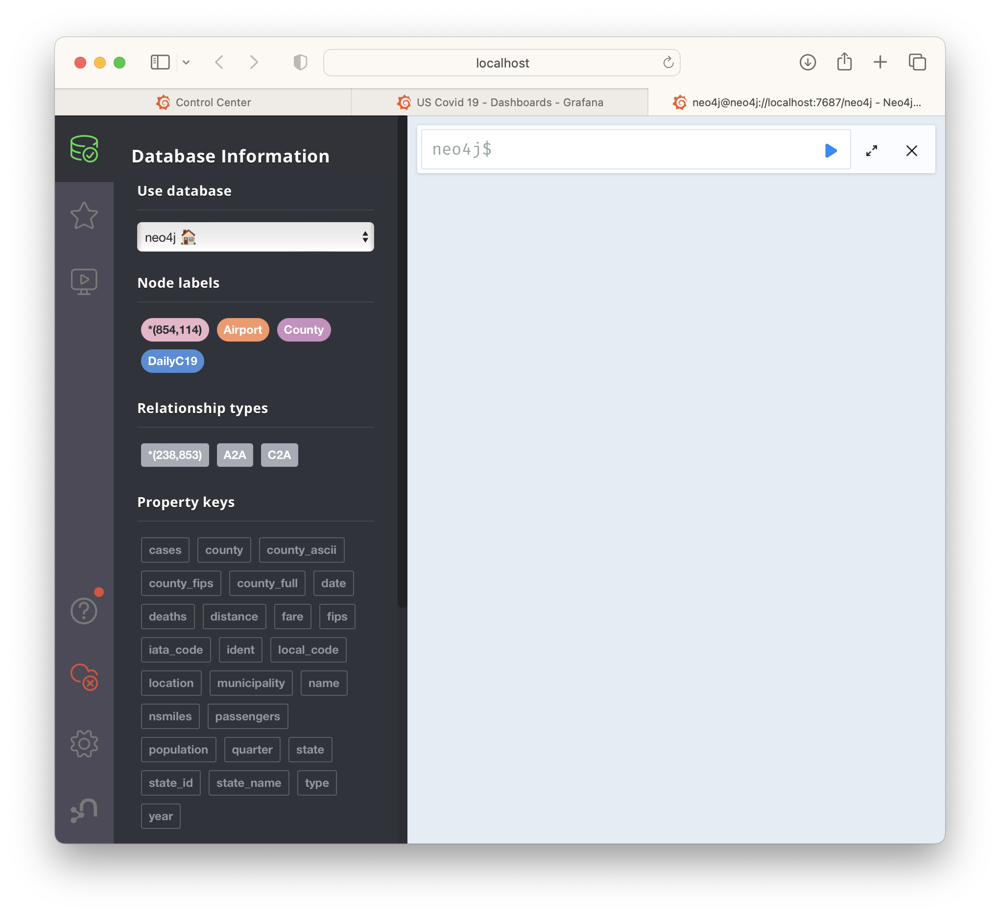

[Prev](./III-a-short-summary-of-data-mesh.md) | [Top](../README.md) | [Next](./V-towards-a-reference-implementation.md)

# IV. The Proof-of-Concept

The PoC is to provide an working system.to illustrate the key points of an possible implementation based on Data Mesh principle with three key subsystems:
- The underlying data streaming infrastructure provided by a Kafka cluster for internal data flows as event streams inside each of the two Data Product instances, see below, as well as external data flows between them.
- A group of software components as an implementation of Data Product principles representing daily COVID report gathering, storing, and monitoring by the State of California and the Federal CDC.
- Another group of software components as another implementation of Data Product principles representing John Hopkins University's data science team collecting master datasets, processing big data, and performing Machine Learning (ML) tasks to find correlations between surges in paris ofcounties connected by air routes.


Each of the sections below describes in details the architecture, functions, configurations, installations, and some functional tests of the subsystems. High-level descriptions accompanied by detailed explaination and concrete technical instructions. The technical instructions, although important for readers who want to repeat the deployment of the PoC on their own computers, local servers or (private) cloud, are not relevant for an overview and understanding of the subsystems.

## IV.1. System Requirements

Any computer system such as a personal computers (PC), physical servers, virtual machines with at least
- 8-core CPUs
- 32 GB RAM memory
- 64 GB disk storage (preferable SDD)
- Ubuntu 22.04-LTS
- Internet connectivity

## IV.2. Github repository

In software development, multiple team members develop code and contribute to creating the software’s functionality. When multiple people contribute to a code base, it is important to maintain its integrity and ensure that any team member can retrieve the latest version and build and run it locally. Github helps to facilitate a **single source of truth**.

### IV.1.a Install system tools

Make sure that you have the following tools installed on the designated system: `git` (or TBC `GitBash` on Windows), `curl`, and `jq`.

### IV.1.b Obtain the PoC source repository

Open a terminal and run:
```bash
    git clone https://github.com/PHACDataHub/data-mesh-poc.git
```

Make sure that a local copy of the repository is ready, then
```bash
	cd data-mesh-poc
```

### IV.1.c (Optional) Keep the repository up-to-date

Fetch the latest source (TBC fetch/pull)
```bash
	git fetch
```
### IV.1.d. (Optional) Visual Code and SSH access

To ease development on the cloud, a combined use of 
+ [Visual Studio Code](https://code.visualstudio.com);
+ [Remote-SSH extension](https://code.visualstudio.com/docs/remote/ssh);
together with a few terminals and port forwarding settings allow developers to *develop directly on and for the cloud*.

## IV.2. Containerized Deployment

The purpose of containerization - by Docker in this case - is to provide a secure, reliable, and lightweight runtime environment for applications that is consistent from host to host. In contrast, the purpose of serverless technology is to provide a way to build and run applications without having to consider the underlying hosts at all.

[Docker Engine](https://docs.docker.com) is an open source containerization technology for building and containerizing your applications.  Docker Compose is a tool for defining and running multi-container Docker applications. With Compose, we can use a YAML file to configure our application’s services. Then, with a single command, we can create and start all the services from our configuration. Docker Compose works in all environments: production, staging, development, testing, as well as CI workflows. It also has commands for managing the whole lifecycle of your application:
+ Start, stop, and rebuild services
+ View the status of running services
+ Stream the log output of running services
+ Run a one-off command on a service

### IV.2.a Install Docker Engine and Docker Compose

Make sure that you are inside the `data-mesh-poc` folder.

To install Docker Engine and Docker Compose, run
```bash
    ./scripts/docker/install.sh
```

Make sure that Docker Engine is running
```bash
    docker system info
```

Test if you can pull and run a `hell-world` Docker image
```bash
    ./scripts/docker/test.sh
```

### IV.2.b (Optional) Cleanup Docker

In case if you need to cleanup previously Docker images, volumes, networks, containers, and folders

```bash
    ./scripts/docker/cleanup.sh
```

### VI.2.c (Optional) Uninstall Docker

In case if you don't want Docker Engine and Docker Compose on your system any more.

```bash
    ./scripts/docker/uninstall.sh
```

Of course, you can reinstall Docker Engine and Docker Compose by running.
```bash
    ./scripts/docker/install.sh
```
*Note: do not install Docker over an existing installation, removing Docker where there is no installation, and other similar cases.*

## IV.3. The Streaming Infrastructure

An event stream is an unbounded sequence of events. An event captures that something has happened. For example, it could be a customer buying a car, a plane landing, or a sensor triggering. In real life, events happen constantly and, in most industries, businesses are reacting to these events in real time to make decisions. So event streams are a great abstraction as new events are added to the stream as they happen. Event streaming systems provide mechanisms to process and distribute events in real time and store them durably so they can be replayed later.

Kafka is an open source project with an open governance under the Apache foundation. It is distributed, scalable, and able to handle very high throughput with high availability. It provides low latency and unique characteristics make it ideal for handling streams of events. Finally the various components of the project create a robust and flexible platform to build data systems.

### IV.3.a The Kafka Cluster


A Kafka Cluster usually consists of:
- Brokers form a Kafka cluster and handle requests for Kafka clients.
- Producers send data to Kafka brokers.
- Consumers receive data from Kafka brokers.
- KSQL provides stream processing (aggregate, transform, filter) capabilities.
- Connectors to enable building data pipelines between Kafka and external systems.

1. Prepare folders for data, logs, and test files

```bash
    ./scripts/kafka/setup.sh
```

2. Start the cluster

```bash
    ./scripts/kafka/start_after_setup.sh
```


### IV.3.b (Optional) Other utilities

1. Stop the cluster

```bash
    ./scripts/kafka/stop.sh
```

2. Restart the cluster (once it has already been set up)

```bash
    ./scripts/kafka/start_again.sh
```

3. Remove the cluster

```bash
    ./scripts/kafka/cleanup.sh
```

***Note: at the first time the `connect` plugins are not propertly installed. You might need to check `connect` logs.***

```
    docker-compose -f docker-compose-kafka.yml logs connect -f
```

scan for 
```
    connect  | Unable to find a component 
    connect  |  
    connect  | Error: Component not found, specify either valid name from Confluent Hub in format: <owner>/<name>:<version:latest> or path to a local file 
```

and then install them manually (for example for the `neo4j` plugin)

```
    docker exec -it connect bash
    confluent-hub install --no-prompt neo4j/kafka-connect-neo4j:5.0.2
```

## IV.4. The Daily Reports


The Kafka Publish/Subscribe (PubSub) model:
- simplify the topology of applications exchanging information with each other: instead of a $n \times n$ matrix, its a $n \times 1$ (applications-to-Kafka) and $1 \times n$ (Kafka-to-applications)
- makes it easy to add or remove applications that want to exchange without affecting any of the others.

Although there are many other technologies that use PubSub, very few provide a durable PubSub system. Unlike other messaging systems, Kafka does not remove data once it has been received by a particular consumer. Other systems have to make copies of the data so that multiple applications can read it, and the same application cannot read the same data twice.

A Kafka record is made up of a `key`, a `value`, a `timestamp` and some `headers`:
- The record `key` is optional and is often used to logically group records and can inform routing;
- The `headers` are also optional. They are a map of key/value pairs that can be used to send additional information alongside the data.
- The `timestamp` is always present on a record, but it can be set in two different ways. Either the application sending the record can set the timestamp, or the Kafka runtime can add the timestamp when it receives the record

Kafka doesn’t store one single stream of data, it stores multiple streams and each one is called a `topic`. When applications send records to Kafka they can decide which topic to send them to. To receive data, applications can choose one or more topics to consume records from. It uses `partitions` to handle a high volume of data by spreading the workload across the different brokers. A partition is a subset of a particular topic. Kafka will guarantee that the records are placed onto the partition in the `order` that it received them.

Kafka can maintain copies or `replicas` of partitions on a configurable number of brokers. This is useful because if one of the brokers goes down, the data in partitions on that broker isn’t lost or unavailable. Applications can continue sending and receiving data to that partition, they just have to connect to a different broker. Kafka client can determine which partition to add your record to using a `partitioner`.

Kafka supports
- **exactly once semantics** via the idempotent and transactional producers;
- **at least once** or **at most once delivery semantics** by configuring producers;

### IV.4.a SpoolDir Connectors

Connectors are plugins we can add to a Kafka Connect runtime. They serve as the interface between external systems and the Connect runtime and encapsulate all the external system specific logic. There are two types of connectors:
- Sink connectors: To export records from Kafka to external systems
- Source connectors: To import records from external systems into Kafka

The Kafka community has implemented connectors for hundreds of popular technologies ranging from messaging systems, to databases, to storage and data warehouse systems. To find connectors for your use case, you can use repositories like [Confluent Hub](https://www.confluent.io/hub/) or the [Event Streams connector catalog](https://ibm.github.io/event-streams/connectors/) that reference the most used and tested connectors.

Now we process US Covid Daily dataset, Airports & Counties & Airport-to-Airport Passenger Traffic master datasets by sending each data point as a record in into various Kafka topics

***Note that please ensure that `jq` is installed.*** Use `sudo apt install jq` on Ubuntu and `brew install jq` on Mac OS.

Setup the connectors and topics to read csv data files

```bash
    ./scripts/kafka/setup_spooldir_connectors.sh
```

This scripts creates four connectors `spooldir_counties`, `spooldir_airports`, `spooldir_arptoarp`, and `spooldir_dailyc19`. Each connector is created by execute a command via REST endpoint of Kafka `connect`:

This is a part of above the script:
```bash
    curl -i -X PUT -H "Accept:application/json" \
        -H  "Content-Type:application/json" http://${connect}/connectors/spooldir_${item}/config \
        -d '{
            "connector.class":"com.github.jcustenborder.kafka.connect.spooldir.SpoolDirCsvSourceConnector",
            "topic":"topic_'${item}'",
            "input.path":"/data/unprocessed",
            "finished.path":"/data/processed",
            "error.path":"/data/error",
            "input.file.pattern":"'${item}'\\.csv",
            "schema.generation.enabled":"true",
            "schema.generation.key.fields":"'${key_fields}'",
            "csv.first.row.as.header":"true",
            "transforms":"castTypes",
            "transforms.castTypes.type":"org.apache.kafka.connect.transforms.Cast$Value",
            "transforms.castTypes.spec":"'${cast_types}'"
            }'
```

The input `csv` files for each connector can be uploaded into `/data/unprocessed` with a prefix `counties`, `airports`, `arptoarp`, or `dailyc19` as specified in `"input.file.pattern":"'${item}'\\.csv"`.

Note that there is a single connector for each topic, but there is *no limit on the number of csv files can be uploaded to the folder, which effectively provides a method of **aggregation** for multiple sources.

The *scheama for data in each connector is generated directly from the data* by specifying `"schema.generation.enabled":"true"`. We add some instructions 
- identify the key for the record: `key_fields_airports=ident`;
- or to transform some of the fields (from string to float data type): `cast_types_airports=lat:float32,lng:float32`

The list of created `spooldir connector`s can easily be seen by using:
```bash
    curl -s localhost:8083/connectors | jq '.[]'
```

We should see something as below
```bash
    "spooldir_counties"
    "spooldir_arptoarp"
    "spooldir_dailyc19"
    "spooldir_airports"
```

On an Ubuntu-based deployment, the list of created `topic`s can also be seen by using:
```bash
    docker exec kafkacat kafkacat -b broker:29092 -q -L  -J | jq '.topics[].topic' | sort
```

(Optional) for Mac OS deployment, after install `kafkakat` by `brew`, we can use:
```bash
    kcat -b localhost:9092 -q -L  -J | jq '.topics[].topic' | sort
```

We should see something as below
```bash
    ...
    "topic_airports"
    "topic_arptoarp"
    "topic_counties"
    "topic_dailyc19"
    ...
```

### IV.4.b (Optional) Using command-line scripts to check if the data points are sent to the topics

To check if the data points are there for the `US daily covid 19` dataset (press Ctrl+C to quit):
```bash
    ./scripts/kafka/get_topic_info.sh topic_dailyc19
```

We should see:
```bash
{
  "key": "\u0000\u0000\u0000\u0000\u0003\u0002\u00142020-12-05\u0002\n56045",
  "payload": {
    "date": {
      "string": "2020-12-05"
    },
    "county": {
      "string": "Weston"
    },
    "state": {
      "string": "Wyoming"
    },
    "fips": {
      "string": "56045"
    },
    "cases": {
      "int": 419
    },
    "deaths": {
      "int": 2
    }
  }
}
% Reached end of topic topic_dailyc19 [0] at offset 793550
```

To check if the data points are there for the `airport` dataset (press Ctrl+C to quit)
```bash
    ./scripts/kafka/get_topic_info.sh topic_airports
```

To check if the data points are there for the `county` dataset (press Ctrl+C to quit)
```bash
    ./scripts/kafka/get_topic_info.sh topic_counties
```

To check if the data points are there for the `airport-to-airport` dataset (press Ctrl+C to quit)
```bash
    ./scripts/kafka/get_topic_info.sh topic_arttoarp
```

### IV.4.c Control Center

We use `Confluent Control Center` to have a better view on the current status of the brokers, topics, messages, etc.
- If the Kafka cluster is deployed on the local machine, navigate to `http://localhost:9021`, select `Topics`.
- If it is deployed on the cloud, use `Remote-SSH Extension` on `Visual Studio Code`, forward the port `9021`, then right-click on the line to open a browser instance to that forwarded port.


We will first see the `Control Center` screen.


Lets click on the `Cluster overview` link (menu item) on the left to see the cluster's overview.


Lets click on the `Brokers` link (menu item) on the left to see the brokers' overview.


Lets click on the `Topics` link (menu item) on the left to see the topic list.


Now, lets click on `topic_airports`, we should see the `topic_airports` topic information:


Select the `Messages` tab then click on the `offset` (next to `Jump to offset`), enter `0`, then we should be able to see messages from the topic.


Select the `Schema` tab then click on the `Key` then we should be able to see the schema for the key, which in this case consists only of the `ident` field.


Select the `Schema` tab then click on the `Value` then we should be able to see the schema for the value, which in this case consists all the fields.


Finally select the `Configuration` tab to see the topic configuration,


### IV.4.d Event streams

Streams applications process data on client-side, so we don’t need to deploy a separate processing engine. Being a key component of the Kafka project, it takes full advantage of Kafka topics to store intermediate data during complex processes. Streams applications follow the read-process-write pattern. One or more Kafka topics are used as the stream input. As it receives the stream from Kafka, the application applies some processing and emits results in real time to output topics.

Stream processing can easily be performed by using `ksqldb` functionalities of Kafka `Control Center` from the browser.


We use stream processing capability of Kafka by first to find the value the `KEY_SCHEMA_ID` of the `topic_dailyc19` by clicking on `Topics`, `topic_dailyc19`, `Schema`, then `Key`,


then, to `create a stream`  called `stream_dailyc19` from the `topic_dailyc19` records', basically turning any topic into a stream;

```
    CREATE STREAM stream_dailyc19 (
        date VARCHAR,
        fips VARCHAR,
        county VARCHAR,
        state VARCHAR,
        cases BIGINT,
        deaths BIGINT
    ) WITH (
        KAFKA_TOPIC='topic_dailyc19',
        KEY_FORMAT='AVRO',
        VALUE_FORMAT='AVRO',
        KEY_SCHEMA_ID=3
    );
```


and finally, to perform (aggregation/transformation/)filtering only the messages to provide California-only daily reports and turn it into a topic `CALIFORNIA_COVID`.

```
    CREATE STREAM california_covid
    AS SELECT 
        ROWKEY, date, fips, county, cases, deaths
    FROM STREAM_DAILYC19
    WHERE state = 'California'
    EMIT CHANGES;
```


## IV.5 Monitoring the reports


### IV.5.a PostgreSQL and Grafana

PostgreSQL, also known as Postgres, is a free and open-source relational database management system emphasizing extensibility and SQL compliance. It was originally named POSTGRES, referring to its origins as a successor to the Ingres database developed at the University of California, Berkeley. 

Grafana is a multi-platform open source analytics and interactive visualization web application. It provides charts, graphs, and alerts for the web when connected to supported data sources. 

Now, the monitoring component contains only a PostgeSQL database and a Grafana visualization software, both run as Docker containers, configured in `docker-compose-postgres.yml` and easily be ran by:

```
    ./scripts/postgres/start_first_time.sh
```


### IV.5.b JDBC Connectors

The daily reports as Kafka records flow from `topic_dailyc19` and `CALIFORNIA_COVID` topic into the database via two connectors, one for each topic. They can be configured in a similar manner via REST endpoints of Kafka `connect`:

```
    ./scripts/postgres/setup_kafka_connector.sh
```

This is a part of above the script:
```bash
    curl -X PUT http://${connect}/connectors/sink-postgres/config \
        -H "Content-Type: application/json" \
        -d '{
            "connector.class": "io.confluent.connect.jdbc.JdbcSinkConnector",
            "connection.url": "jdbc:postgresql://'${postgres}'/",
            "connection.user": "postgres",
            "connection.password": "postgres",
            "tasks.max": "1",
            "topics": "'${topic_name}'",
            "auto.create": "true",
            "auto.evolve":"true",
            "pk.mode":"record_value",
            "pk.fields":"'${composite_keys}'",
            "insert.mode": "upsert",
            "table.name.format":"'${topic_name}'"
        }'
```

Note that we can define composite key (a key as a comnbination of multiple data fields) as `composite_keys=date,fips`.

To see if the connectors are successfully created:
```bash
    curl -s "http://localhost:8083/connectors?expand=info&expand=status" | \
        jq '. | to_entries[] | [ .value.info.type, .key, .value.status.connector.state, .value.status.tasks[].state, .value.info.config."connector.class" ] | join (":|:")' | \
        column -s : -t | sed 's/\"//g' |sort
```

We should see something similar to
```bash
    sink    |  sink-california-covid   |  RUNNING  |  RUNNING  |  io.confluent.connect.jdbc.JdbcSinkConnector
    sink    |  sink-postgres           |  RUNNING  |  RUNNING  |  io.confluent.connect.jdbc.JdbcSinkConnector
    source  |  spooldir_airports       |  RUNNING  |  RUNNING  |  com.github.jcustenborder.kafka.connect.spooldir.SpoolDirCsvSourceConnector
    source  |  spooldir_arptoarp       |  RUNNING  |  RUNNING  |  com.github.jcustenborder.kafka.connect.spooldir.SpoolDirCsvSourceConnector
    source  |  spooldir_counties       |  RUNNING  |  RUNNING  |  com.github.jcustenborder.kafka.connect.spooldir.SpoolDirCsvSourceConnector
    source  |  spooldir_ctytoarp       |  RUNNING  |  RUNNING  |  com.github.jcustenborder.kafka.connect.spooldir.SpoolDirCsvSourceConnector
    source  |  spooldir_dailyc19       |  RUNNING  |  RUNNING  |  com.github.jcustenborder.kafka.connect.spooldir.SpoolDirCsvSourceConnector
```

Once created, the records will automatically populate the PostgreSQL database without any manual intervention.

### IV.5.c (Optional) Verify if the database is populated

```bash
    docker exec -it postgres bash -c 'psql -U $POSTGRES_USER $POSTGRES_DB'

    psql (12.13 (Debian 12.13-1.pgdg110+1))
    Type "help" for help.

    postgres=#     
```

then inside PosgreSQL command line prompt:
```postgres
    postgres=# \dt
                List of relations
    Schema |       Name       | Type  |  Owner   
    --------+------------------+-------+----------
    public | CALIFORNIA_COVID | table | postgres
    public | topic_dailyc19   | table | postgres
    (2 rows)

    postgres=# 
```

```postgres
    postgres=# SELECT * FROM topic_dailyc19 FETCH FIRST 10 ROWS ONLY;
        date    |   county    |   state    | fips  | cases | deaths 
    ------------+-------------+------------+-------+-------+--------
    2020-01-22 | Snohomish   | Washington | 53061 |     1 |      0
    2020-01-23 | Snohomish   | Washington | 53061 |     1 |      0
    2020-01-24 | Cook        | Illinois   | 17031 |     1 |      0
    2020-01-24 | Snohomish   | Washington | 53061 |     1 |      0
    2020-01-25 | Orange      | California | 06059 |     1 |      0
    2020-01-25 | Cook        | Illinois   | 17031 |     1 |      0
    2020-01-25 | Snohomish   | Washington | 53061 |     1 |      0
    2020-01-26 | Maricopa    | Arizona    | 04013 |     1 |      0
    2020-01-26 | Los Angeles | California | 06037 |     1 |      0
    2020-01-26 | Orange      | California | 06059 |     1 |      0
    (10 rows)
```

```
    postgres=# SELECT * FROM "CALIFORNIA_COVID" FETCH FIRST 10 ROWS ONLY;
        DATE    | FIPS  |   COUNTY    | CASES | DEATHS 
    ------------+-------+-------------+-------+--------
    2020-01-25 | 06059 | Orange      |     1 |      0
    2020-01-26 | 06037 | Los Angeles |     1 |      0
    2020-01-26 | 06059 | Orange      |     1 |      0
    2020-01-27 | 06037 | Los Angeles |     1 |      0
    2020-01-27 | 06059 | Orange      |     1 |      0
    2020-01-28 | 06037 | Los Angeles |     1 |      0
    2020-01-28 | 06059 | Orange      |     1 |      0
    2020-01-29 | 06037 | Los Angeles |     1 |      0
    2020-01-29 | 06059 | Orange      |     1 |      0
    2020-01-30 | 06037 | Los Angeles |     1 |      0
    (10 rows)
```

To exit:
```
    postgres=# \q
```

### IV.5.d Grafana visualizations

First we need to access Grafana by
- open a browser at `localhost:3000`, if the cluster is deployed on your local machine, or
- forward the port `3000` on your `Visual Studio Code` (similar to the way to access Kafka `Control Center` in the previous part), and then open the browser.

Type `admin` for both username and password for the first login, then set the password for later use.

Navigate to the configuration (click on the cog at the top at the bottom menu on the left), then select `PostgreSQL` for the data source. Use `postgres:5432` for `Host`, `postgres` for all `Database`, `User`, and `Password`. Select ``disable` for `TLS/SSL Mode` for now. `Save & test` the connection.


Once done, click on the `Dashboard` (four squares) to create dashboards. There are several ways to create them. One is to create an empty dashboard, then an empty panel, then select `PostgreSQL` as data source, add the `SQL` queries, then customize the look-and-feel.

We show a shortcut by select `Import` on `Dashboards` and then copy the content of [grafana_us.json](../conf/grafana_us.json) or  [grafana_california.json](../conf/grafana_california.json) into  the `Import via panel json` textbox and `Load` it. 


Once done, we will need to go into each of the panel of the newly imported dashboard and select the current PostgreSQL instance for the dashboard.


If done without any problems, we should be able to see both monitoring dashboard for the Federal CDC


and one for California State


### IV.5.e (Optional) Stop, restart, and cleanup

1. Stop the cluster

```bash
    ./scripts/postgres/stop.sh
```

2. Restart the cluster (once it has already been set up)

```bash
    ./scripts/postgres/start_again.sh
```

3. Remove the cluster

```bash
    ./scripts/postgres/cleanup.sh
```

## IV.5. The Search for Correlations

### IV.5.a Big data processing by Spark


Apache Spark is an open-source unified analytics engine for large-scale data processing. Spark provides an interface for programming clusters with implicit data parallelism and fault tolerance.

To perform computations to find nearby airports for each county, se setup a Spark cluster

1. Setup a Spark master and three slaves

```bash
    ./scripts/spark/start_first_time.sh
```


2. Run the Spark app

```bash
    ./scripts/spark/run_spark_app.sh
```

3. Push the results into the `topic_ctytoarp` topic via a `spooldir` connector

```bash
    ./scripts/spark/setup_kafka_connector.sh
```

4. (Optional) Check if the data points are there (press Ctrl+C to quit)

```bash
    ./scripts/kafka/get_topic_info.sh topic_ctytoarp
```

5. (Optional) Stop the cluster

```bash
    ./scripts/spark/stop.sh
```

6. (Optional) Restart the cluster (once it has already been set up)

```bash
    ./scripts/spark/start_again.sh
```

7. (Optional) Remove the cluster

```bash
    ./scripts/spark/cleanup.sh
```

### IV.5.b Surge Correlation Detection by Neo4j


Neo4j is a graph database management system developed by Neo4j, Inc. Described by its developers as an ACID-compliant transactional database with native graph storage and processing.

1. Setup a Neo4j and neodash

```bash
    ./scripts/neo4j/start_first_time.sh
```



Note that we have to wait until `neo4j` is ready. There are several ways to do so, the easier, although not the best for automation, is to scan the log if `Neo4j` is `Started`

```bash
    docker compose docker-compose-neo4j.yml logs neo4j -f
```

2. Setup the constraints and indexes for faster data search

```bash
    ./scripts/neo4j/setup_database.sh
```

3. Connect to Kafka to receive all data

```bash
    ./scripts/neo4j/setup_kafka_connector.sh
```

By opening a browser to port `localhost:7474`, we can see if the data are successfully imported. See the number of nodes.



4. We then have to perform a few queries on the `neo4j browser` to get the data ready for our study:

Sum up quarterly passenger traffic to make it annual
```
    CALL apoc.periodic.iterate("
        MATCH (a1:Airport)
        RETURN a1 ORDER BY a1.ident
    ","
        WITH a1
            MATCH (a1)-[r1:A2A]-(a2:Airport) 
                WHERE a1.ident < a2.ident
        WITH DISTINCT(a2) AS a2, SUM(r1.passengers)/COUNT(r1) AS passengers, a1
            MERGE (a1)-[r:A2A_PT]-(a2)
                SET r.passengers = passengers
    ",
        {batchSize:1, parallel:false}
    )
```


Sum up passenger traffic per air route for each connected county pairs
```
    CALL apoc.periodic.iterate("
        MATCH (c1:County)
        RETURN c1 ORDER BY c1.county_fips
    "," 
        WITH c1
            MATCH (c1)-[:C2A]-(a1:Airport)-[r1:A2A_PT]-(a2:Airport)-[:C2A]-(c2:County)
                WHERE a1 <> a2 AND c1 <> c2 AND NOT((c1)-[:C2C_PT]-(c2))
        WITH DISTINCT(c2) AS c2, SUM(r1.passengers) AS passengers, c1
        WITH c1, c2, passengers
            MERGE (c1)-[r:C2C_PT]-(c2)
                SET r.passengers = passengers
        WITH DISTINCT(c1) AS c1, SUM(passengers) AS passengers
        WITH c1, passengers
            SET c1.passengers = passengers
    ",  
        {batchSize:1, parallel:false}
    )
```

Here is an example: counties connected by air routes to Snohomish County, Washington State:


Setting valid date range (having Covid data) for each county
```
    MATCH (c:County)
    WITH c
        MATCH (d:DailyC19 {fips: c.county_fips})
    WITH c, d.date AS date ORDER BY date ASC
    WITH DISTINCT(c) AS c, COLLECT(date) AS dates
    WITH c, HEAD(dates) AS min_date, HEAD(REVERSE(dates)) AS max_date
        SET c.min_date = min_date, c.max_date = max_date
```

5. Once the data is ready, then we compute correlations among connectecd counties and cluster them

Compute correlation (based on sum of squares of dfference in cases as population percentage) of every connected county pairs.
```
    CALL apoc.periodic.iterate("
        MATCH (c1:County)-[r:C2C_PT]-(c2:County)
        WHERE c1.county_fips < c2.county_fips
        RETURN c1, r, c2,
            (CASE c1.min_date <= c2.min_date WHEN TRUE THEN c2.min_date ELSE c1.min_date END) AS min_date, 
            (CASE c1.max_date <= c2.max_date WHEN TRUE THEN c1.max_date ELSE c2.max_date END) AS max_date
    "," 
        WITH c1, r, c2, min_date, max_date
        MATCH (d1:DailyC19 {fips: c1.county_fips})
            WHERE d1.date >= min_date AND d1.date <= max_date
        WITH c1, r, c2, d1 
            MATCH (d2:DailyC19 {fips: c2.county_fips, date: d1.date})
        WITH c1, r, c2, d1.date AS date, (d1.cases*100.0/c1.population)-(d2.cases*100.0/c2.population) AS diff
        WITH DISTINCT(c1) AS c1, r, c2, SQRT(SUM(diff*diff)/COUNT(diff)) AS sos
        WITH r, sos            
            WHERE sos <= 0.2
            SET r.sos = sos
    ",
        {batchSize:1000, parallel:true}
    )
```

Perform `Louvain clustering` algorithm
```
    CALL gds.graph.drop('correlatedCounties');
```

```
    CALL gds.graph.project(
        'correlatedCounties',
        'County',
        {
            C2C_PT: {
                orientation: 'UNDIRECTED'
            }
        },
        {
            relationshipProperties: 'sos'
        }
    )
```

```
    CALL gds.louvain.write.estimate('correlatedCounties', { writeProperty: 'community' })
    YIELD nodeCount, relationshipCount, bytesMin, bytesMax, requiredMemory
```

```
    CALL gds.louvain.write('correlatedCounties', { writeProperty: 'community' })
    YIELD communityCount, modularity, modularities
```

### IV.5.e Neodash visualization

Neodash supports presenting your data as tables, graphs, bar charts, line charts, maps and more. It contains a Cypher editor to directly write the Cypher queries that populate the reports. You can save dashboards to your database, and share them with others.

Following Cypher queries are use to fetch and show correlated data

```
    MATCH (c1:County {county_fips: "06037"})-[r:C2C_PT]-(c2:County)
        WHERE r.sos <= 0.2
    RETURN c2.county_fips, c2.county_ascii, c2.state_name, r.sos ORDER BY r.sos ASC
```

```
    MATCH (d1:DailyC19 {fips: "06037"}), (c1:County {county_fips: "06037"})
        WHERE d1.date >= "2020-04-01"
    WITH d1, c1
        MATCH (d2:DailyC19 {fips: "37119", date: d1.date}), (c2:County {county_fips: "37119"})
    WITH d1, c1, d2, c2
        MATCH (d3:DailyC19 {fips: "22103", date: d1.date}), (c3:County {county_fips: "22103"})
    WITH d1, c1, d2, c2, d3, c3
        MATCH (d4:DailyC19 {fips: "12071", date: d1.date}), (c4:County {county_fips: "12071"})
    WITH d1, c1, d2, c2, d3, c3, d4, c4
        MATCH (d5:DailyC19 {fips: "13121", date: d1.date}), (c5:County {county_fips: "13121"})
    RETURN DATE(d1.date) AS date, 
        d1.cases*100.0/c1.population AS Los_Angeles_CA,
        d2.cases*100.0/c2.population AS Mecklenburg_NC,
        d3.cases*100.0/c3.population AS St_Tammany_LA,
        d4.cases*100.0/c4.population AS Lee_FL,
        d5.cases*100.0/c5.population AS Fulton_GA
        LIMIT 250
```

The results are visualized via Neodash.

Top 4 correlated counties to Los Angeles County, California


All correlated counties to Los Angeles County, California


[Prev](./III-a-short-summary-of-data-mesh.md) | [Top](../README.md) | [Next](./V-towards-a-reference-implementation.md)